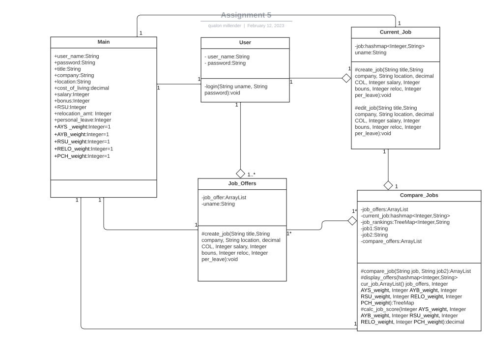
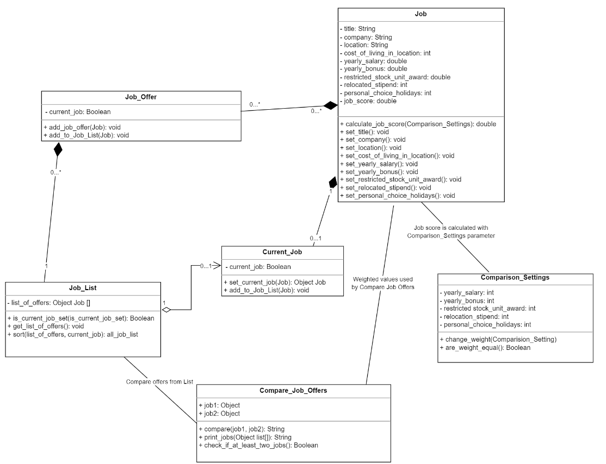

# Design-discussion
## Individual Design
###### Design 1
qmillender3

Pro
Using a key(username) to map with job information
-this allows the current job to be stored in a hashmap. This creates the process of only updating the key in the hashmap when a current job is edited. This works for space because the hashmap does not allow duplicates 
, but will not work if the user needs all previous jobs stored for historical reasons. 

Simple design
- the design is basic and not overcrowded. It makes it easy to understand what the diagram is trying to accomplish

Con
Too many variables in main class
-main class has too many variables which is not good for overall design. Main class can be removed and variables can be split to other classes.

The job offer can be extended from current job or be combined into one class
-Job offer and current job are similar with only minor variable differences. This shows that the job offer class can be an extension of current job or combine them into one class.  

User classes may be outside of requirements
-The reason we added this as a con was because the requirements did not state there needed to be a user login.
 
###### Design 2
jjia66

Pro
Simple design
-The design is very simple and concise. It captures all the needed requirements and functionality in a three class design.
Meets all requirements 
-the design meet all requirements required by document

Con
Needs to add more methods
-The design meets all requirements, but the team decided that some more methods will need to be added for displaying the information.

Does not have to store score in job

  
###### Design 3
nli311

Pro
Appropriate use of relationships
-Design uses stronger relationships than the other. The relationship shows that certain classes can not exist without other classes. The relationships help make sure we have the correct between classes. 
Meets all requirements 
-the design meet all requirements required by document

Con
Some data structures would be changed to handle data better
-Design could use better data structure for storing and accessing data. Some variables may be better as hashmaps for the data that is being stored in it. 

Needs to explore the implementation of comparison setting more
-Team decided that there is a simpler way of implementing the comparison function. The comparison settings does not have to be a separate class

## Team Design

Our main commonalities for the design are the Job class and its attributes. The team design also shares a hashmap for the Job data structure. The main design differences are the reduced amount of Classes. Compare_Jobs and Comparison Settings are merged into a single Class. The same is said for Job, Job_Offers, and Current_Job. This team design was selected based on the principle of simplicity and avoiding over-complication of the project.

## Summary
After reviewing all designs, our group chose a modified version of Jia's UML diagram for our team design because of its simple and concise layout. We learned that people view and implement requirements differently into their design. Sometimes designs can be very simple and accomplish the task at hand. During discussion, we realized that some designs contain too many variables in classes, classes could be combined, and some classes could be completely removed. Having another set of eyes on your design, it was really helpful in catching some areas that you may have missed when initially designing the uml. One major lesson learned is that we all have different ideas of implementing the requirements, but working together allowed us to take the best part of our ideas and make improvements to the team design.