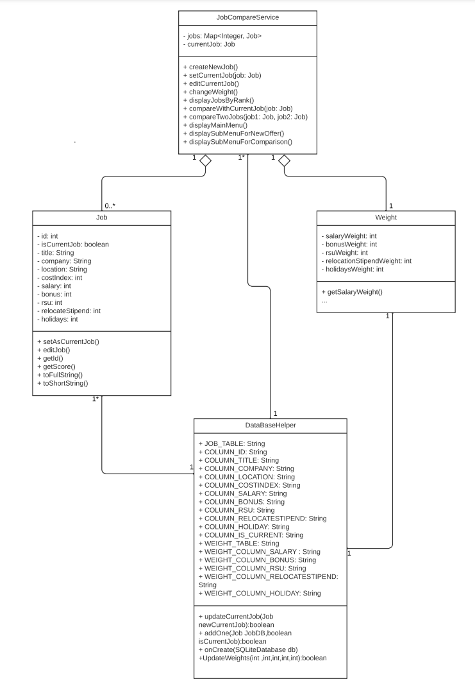

# Design Document

**Author**: Team 146

## 1 Design Considerations

### 1.1 Assumptions

The application will be developed in android studio using java 11 with a minimum sdk of api31:android 12. The app will only be developed for devices with an android operating system. The app state will persist between runs storing the information for one user. User will be able to view,add, or update current job. Users will also be able to add job offers and compare between job offers. Users can adjust weights for COL metrics. 

### 1.2 Constraints

Users must be able to enter a job if no current job is located in the system. App state must persist between runs and store user data. User can not compare jobs if only one job is stored in the system. App must return a list of job offers and current jobs in order by ranking the job score in descending order.
Comparison setting weights have to be used in COL calculation and must default to all factors being equal. User can only compare two jobs at a time

### 1.3 System Environment

The hardware will be devices that are running an android operating system that have the requirements to run API 31 or higher. The software the system will interact with is Android studios using java 11 with a minimum SDK API 31:Android 12

## 2 Architectural Design

The hardware will be devices that are running an android operating system that have the requirements to run API 31 or higher. The software the system will interact with is android studios using java 11 with a minimum SDK API 31:Android 12

### 2.1 Component Diagram

The application is a simple system with only a few outside components that interact with the application. We have user, android device, and the database is self contained in the application by
using the Android SQLite. For those reasons, I do not think a component diagram is needed, but I have supplied one.

### 2.2 Deployment Diagram

Application is a simple system with components self contained in the application. The system will only have to deploy the application to an android device without having to deploy any external components.

## 3 Low-Level Design

### 3.1 Class Diagram

## 4 User Interface Design

