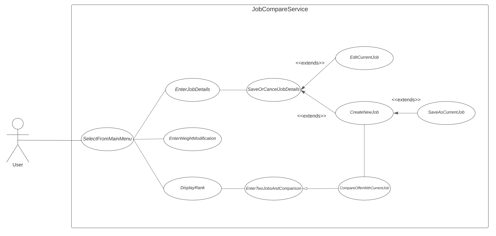

# Use Case Model

**Author**: jjia66

## 1 Use Case Diagram

## 2 Use Case Descriptions

1 SelectFromManuMenu

Requirements:
Ask the user to make a select between 4 options: (1)Enter or Edit current job details (2)Enter job offers (3)Adjust the comparison settings (4)Compare job offers

Pre-conditions:
There are several conditions to trigger this use case: (1)Just enter the system (2)After save the new entered job (3)After cancel saved new entered job (4)After save modified Weight (5)After compare 2 jobs

Post-conditions:
The user must make a selection from 4 options

Scenarios:
For option 1 & 2, it will enter the UI to Enter Job Details. For option 3, it will enter the UI to modify the comparison weight. For option 4, it will enter DisplayRank&Select2Jobs use case. The UI should limit the option to 1 to 4, and it should remind the user to reenter is ilegal input got.

2 Enter Job Details

Requirements: 
The UI will show all the detail items of job/offer, including: (1)Title (2)Company (3)Location (4)Cost of living index in the location (5)Yearly salary (6)Yearly bonus (7)RSU (8)Relocation stipend (9)Personal choice holidays.

Pre-conditions:
It will com to this use case for following situation: (1)Select option 1 in SelectFromMainMenu use case (2)Select option 2 in SelectFromMainMenu use case (3)In SaveOrCancleJobDetails use case, after select Enter another offer

Post-conditions:
There exists some limitations to some limits: input of 4,5,6,7,8,9 must be valid integer numbers. And there are some range limitations: (8)between 0 - 25000, (9)between 0 - 20;

Scenarios: 
The system should check if current job exists before this step. If no current job exists, the UI will display as empty for all elements. But if current job exists, the information of current job should be display for the reedit reference.

3 SaveOrCancelJobDetails

Requirements: 
This use case ask the use to save or cancel the entered job details.

Pre-conditions:
This use case is just right after the EnterJobDetails use case.

Post-conditions:
The user can only select from Save or Cancel.

4 EditCurrentJob

Requirements: 
There is no input requirements for the user. But the system should check the current job info and if the EnterJobDetails is from job instead of offer option.

Pre-conditions:
There are 2 pre-conditions for this use case (1)The user select first option Enter or Edit current job in SelectFromMainMenu use case (2)There already exists a current job

Post-conditions:
Make sure the edited new info are valid.

Scenarios: 
To realize the two pre-conditions of this use case (1)In JobCompareService entry point, the CurrentJob should be added as an attribute, and use ifNull to tell if a current job exists (2)There should exist a parameter to remember the choice in SelectFromMainMenu option

5 Create New Job

Requirements: 
There is no input requirements for the user. But the system should check the current job info and if the EnterJobDetails is from job instead of offer option. This use case will cover all other situations from EditCurrentJob

Pre-conditions:
The Pre-Conditions are the opposite to EditCurrentJob

Post-conditions:
Make sure the edited new info are valid.

6 SaveAsCurrentJob

Requirements: 
There is no input requirements for the user. But the system should check if option 1 is selected in the SelectFromMainMenu use case (if CurrentJob exists is already checked in the CreateNewJob use case)

Pre-conditions:
This use case if a follow up of the CreateNewJob use case if Option 1 is selected in the SelectFromMainMenu use case

Scenarios: 
There exists 2 CurrentJob marker in the system (1)CurrentJob attribute in the JobCompareService entry point (2)isCurrentJob attribute in Job class. Currently the software requirements don’t have the switch current job requirement, and suggest to add this feature to improve the system.

7 EnterWeightModification

Requirements: 
The user should enter the weight of 5 different considerations for comparisons including (1)Yearly salary (2)Yealy bonus (3)RSU (4)Relocation stipend (5)Personal Choice Holidays

Pre-conditions:
It will come to this use case when Select Option 3 in SelectFromMainMenu use case

Post-conditions:
The input must be integer. And it is suggested to have a limit to each item, like 1 as minimum, and 10 as maximum.

Scenarios: 
The default value of all 5 elements are all 1. So all other comparisons are allowed even without settings in this use case.

8 DisplayRank&Enter2Jobs

Requirements: 
This use case does not ask for input from the user, but display the rank list of all enter jobs and offers from best to worst based on performance of 5 weighted standard. In the rank list, it only asks for the id, position and company name but not other details (id is used for the EnterTwoJobsForComparison use case, otherwise the user cannot make a selection). And the current job must be marked if exists.

Pre-conditions:
This use case is entered when Option 4 is selected in the Use Case SelectFromMainMenu.

Post-conditions:
No specific post-conditions for this use case;

Scenarios: 
We have assumed the display rank is not a frequently called api, so we won’t save the score of a job as an attribute, but do the calculation and sort based on the most recently weight. This design will avoid the useless updates of score once weight is changed.

9 EnterTwoJobsAndComparison

Requirements: 
The user should select 2 job id from the Job Rank list.

Pre-conditions:
This use case will be used right after DisplayRank use case. And another pre-conditions is there must exist at least 2 jobs saved in the system already.

Post-conditions:
Check if the 2 job id is valid.

Scenarios: 
To help the user to select the jobs the user want to compare, a jobId attribute is added to the Job class. And also used as the key of the map to store the job information in JobCompareService entry point.

10 CompareOfferWithCurrentJob

Requirements: 
This use case does not ask for input from the user, but just get the new successfully create offer and current job to make a comparison. 

Pre-conditions:
The option (3)Compare offer with current job details option must be selected (CreateNewJob use case must be executed successfully). And the current job must be exist.

Post-conditions:
If current job exists condition should be examined in the UI display step. Should give the user a remind but gray out the option if no current job exists.

Scenarios: 
This use case could reuse the CompareTwoJobs methed used in the EnterTwoJobsForComparison use case, by just assign the job id by new entered offer id and current job id.

